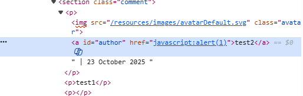
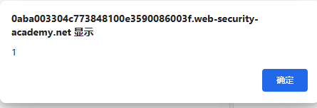

# Writeup -- Stored XSS (Stored XSS into anchor href attribute)
- 在`PortSwigger`的`Lab: Stored XSS into anchor href attribute with double quotes HTML-encoded`中的评论功能中，我发现`website`字段的输入被直接写入作者链接的`href`属性（属性上下文），未对协议或危险字符进行严格校验，导致点击链接后会触发JS代码。
- 复现步骤
	- 1)对`postId=7`的评论提交`website=javascript:alert(1)`（见[raw_request.txt](raw_request.txt)）；
	- 2)刷新帖子详情页，在Elements可见`<a id="author" href="javascript:alert(1)">`（见）
	- 3)右键复制该链接地址并粘到地址栏回车，触发2浏览器执行`alert(1)`（见）。
- 该漏洞为存储型XSS，影响为该页面所有访问并点击链接的用户，攻击者可执行任意JS（会话窃取、钓鱼、内容篡改等）。
- 建议服务端对`website`字段实行协议白名单（仅允许`http(s)://`），对属性输出做context-aware encoding，并在前端避免直接将用户输入写入可执行属性；同时部署CSP限制内联脚本和危险协议。
- 证据见附件：raw_request.txt，raw_response.txt，dom.png，popup.png